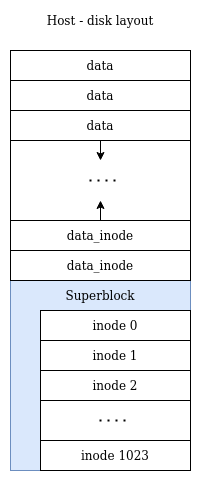
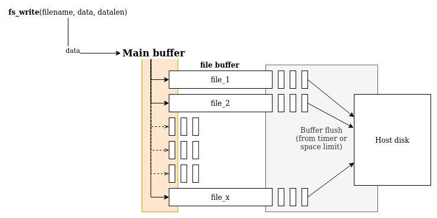
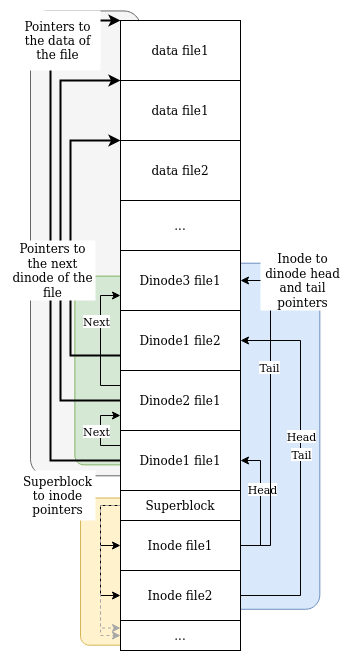

# ZCFS, filesystem for STM32
_Lightweight hosted filesystem for STM32 by Crosta Alberto and Matteo Zoia_

## About
ZCFS is an hosted-based log-structured filesystem, this means that all data are stored within an host machine attached to the board.
_Why an hosted filesystem?_ Only few STM32 boards have access to an SD slot to store data file and unfortunately our develop board doesn't have such slot, so with this FS we want to offer the ability to store data to all STM32 boards (included the ones without the SD slot capability). The approach of ZCFS is to use a protocol to exchange data with an external machine that keeps files stored for it.

_Why a log-structured filesystem?_
On the IoT devices is commonly used to log every action, this FS was created to improve the speed and to simplify such workload.

_Why a filesystem that store data on an external host?_
Because it could be very helpful to store externally lot of information that the IoT devices cannot maintain.
It is also useful to do offline analisys on the stored data.

Features:
* Real-size filesystem, with an host-based filesystem you can use as much memory as your host machine (this may be overkill for embedded system).
* Offer filesystem to all STM32 board with UART protocol
* Log-structured filesystem, best solution for embedded system purpose (logging, monitoring, little configuration write...)
* Fast file inspection, is possible to directly inspect the file on the hosted machine
* Fast dump and restore, you can easy export all data on the FS and restore entire file hierarchy to another board

## Memory/Disk layout
The folloing image explains how the ZCFS manages the data and how stores it on the disk.

There are 4 main structures:
- [**Raw data**] are the data bytes that the fs writes on the disk
- [**Dinodes (data inode)**] are the structs that points to the data contained in the file. A single file could have multiple dinode structured as a classic C linked list
- [**Superblock**] is the main block with the information about how many data are written on disk and how to access to the file inode
- [**Inodes**] is the memory representation of the opened file. It contains information such as the name, the size and where to find the dinodes of the file

## Buffer management
It was decided to not write instantly every data written from the ZCFS but a buffer is initialized and filled until the time or space reaches the limit specified. This could help to reduce the overhead of the USART/Disk writing.

The default values are the following:
- Timer: set to 1s
- Buffer: size limit set to 4KB

## ZCFS API
As all file-system some API were created to interact with it.
(See the code at [fs\_syscalls.h](zcfs_stm32/Core/Inc/fs_syscalls.h)  and [fs\_syscalls.c](zcfs_stm32/Core/Src/fs_syscalls.c) to learn more)
The user could use the following syscalls:
- `zcfs_init(UART_HandleTypeDef* huart,DMA_HandleTypeDef* tx,DMA_HandleTypeDef* rx)`
initializes the file-system ZCFS environment and all its structures.
- `zcfs_open(char* file_name)`
opens a file, creating all structure on the disk and in memory.
- `zcfs_close(uint32_t fd)`
closes the specific file, removing it from the opened ones but left the other structure so the user can have the possibility to reopen it later.
- `zcfs_write(int fd, char* ptr, int len)`
writes the data in the file, only if the file is opened.
- `zcfs_read(uint32_t fd, char* data, int start, int stop)`
reads the the file (entirely or not), only if the file is opened.

## Full system schema
Below the image with the entire disk/memory structure

## Applications
- Application continuous logs

## Future improvements
- At the startup, create a init file to load the snapshot
- Use different protocol (I2C, SPI, ...)
- Inspect offline snapshot
- ...

